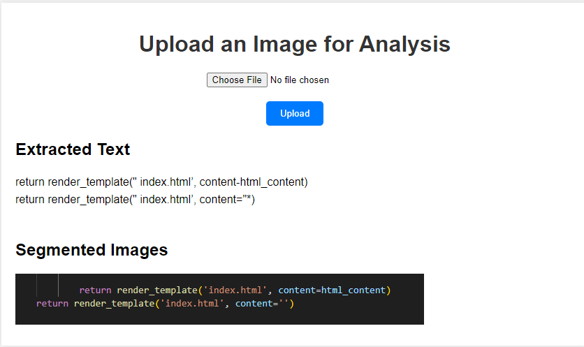

# Image Analysis Project Report

## Introduction

This project aims to separate text and visual elements from images using OCR and basic image segmentation techniques.

## Technologies Used

- **Python**: Programming language
- **Flask**: Web framework for creating a simple interface
- **Tesseract OCR**: Tool for text extraction from images
- **OpenCV**: Library for image processing
- **Pillow**: Library for handling images in Python

## Implementation Details

### Text Extraction

The `pytesseract` library is used to perform OCR on the uploaded images.

### Visual Element Segmentation

Basic image segmentation is done using contour detection provided by the `opencv-python` library.

### HTML Generation

Extracted text and segmented images are embedded into an HTML template.

## Challenges

- Ensuring accurate text extraction from various image types.
- Handling different image formats and resolutions.
- Segmenting visual elements effectively.

## Conclusion

The project successfully extracts text and visual elements from images and presents them in an HTML format.

## Future Work

- Improve segmentation accuracy.
- Handle complex layouts and designs.

## Examples

