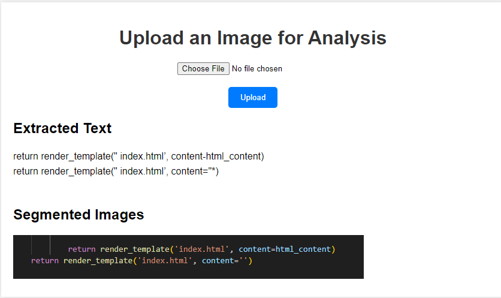

# Image Analysis Project

## Overview
This project separates text and visual elements from an uploaded image using OCR and image segmentation techniques.

## Setup

1. Clone the repository:
   ```sh
   git clone https://github.com/danish101-sohail/fisheye-OCR.git

2. Install dependencies:
    ```sh
    pip install -r requirements.txt

3. Ensure Tesseract OCR is installed and configured correctly.

## Running the Application
    python app.py

## Usage
Open your web browser and navigate to http://127.0.0.1:5000/.
Upload an image file to see the extracted text and segmented visual elements.

## Examples


